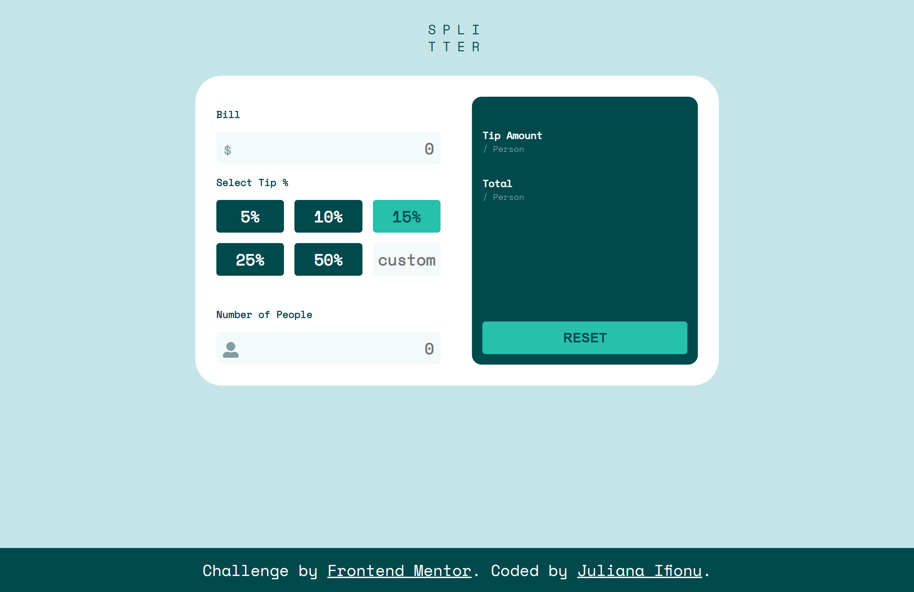

# Frontend Mentor - Tip calculator app solution

This is a solution to the [Tip calculator app challenge on Frontend Mentor](https://www.frontendmentor.io/challenges/tip-calculator-app-ugJNGbJUX). Frontend Mentor challenges help you improve your coding skills by building realistic projects.

## Table of contents

- [Overview](#overview)
  - [The challenge](#the-challenge)
  - [Screenshot](#screenshot)
  - [Links](#links)
  - [Built with](#built-with)
  - [What I learned](#what-i-learned)
  - [Continued development](#continued-development)
  - [Useful resources](#useful-resources)
- [Author](#author)
- [Acknowledgments](#acknowledgments)

## Overview
This is a calculator app that calculates the amount to tip a waiter/waitress.

### The challenge

Users should be able to:

- View the optimal layout for the app depending on their device's screen size
- See hover states for all interactive elements on the page
- Calculate the correct tip and total cost of the bill per person

### Screenshot

### Links

- Live Site URL: [live site URL](https://julie-ify.github.io/Calculator-App/dist/)

### Built with

- Semantic HTML5 markup
- CSS custom properties
- Flexbox
- CSS Grid
- JavaScript
- Mobile-first workflow

### What I learned

What I learned building this app is having more knowledge of Flexbox, CSS Grid and most importantly brushing up my JavaScript skills. 

### Continued development

I will be implementing the Reset button to reset the tip amount and total amount per peron soon

### Useful resources

- [resource 1](https://www.tutorialspoint.com/How-to-format-a-number-with-two-decimals-in-JavaScript) - This is where I got the method `toFixed` which I used to place amounts to 2 decimal places.
- [resource 2](https://stackoverflow.com/questions/14542062/eventlistener-enter-key) - This is where i got the information to add event listener when user press the 'enter'. key

## Author

- Website - [Juliana Ifionu](https://github.com/julie-ify/Portfolio-Mobile-version)
- Frontend Mentor - [@julie-ify](https://www.frontendmentor.io/profile/julie-ify)
- Twitter - [@juliana_ifionu](https://www.twitter.com/juliana_ifionu)

## Acknowledgments

I want to use this opportunity to thank Frontend Mentor for providing the design for this app.
I want to also acknowledge [Microverse](https://github.com/microverseinc) where I'm currently learning to become a software developer.

